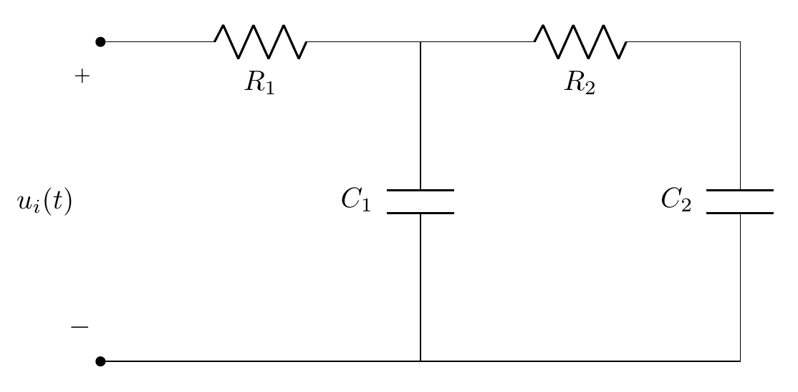

# Laboratorio de control moderno

## Tabla de contenidos
* [Información general](#Información)
* [Descripción del Hardware usado](#Hardware)
* [Modelo matemático](#Modelado)
* [Diseño de controladores y observadores](#Diseño)
* [Descripción del Software usado](#Software)

## Información
Este proyecto muestra como implementar controladores y observadores lineales mediante la plataforma Arduino.

## Hardware
El algoritmo de control/observación se realiza en la plataforma Arduino UNO R3 y una planta RC-RC, con $R1 = R2 = 1$ Mohm, y $C1 = C2 = 1$ uf. Una descripción del hardware usado es mostrada en la Figura siguiente.  En adición a la planta RC-RC, se usa un potenciometro para generar la referencia externa, un par de switches para iniciar y detener el algoritmo de control, y un par de Leds para mostrar el estado del sistema.


### La lista de partes es la siguiente:

* Una placa de desarrollo Arduino UNO R3
* Un breadboard o un shield LCFIME-PCB 1.0-RC3.
* 2 resistencias de 1 Mohm. 
* 2 capacitores de 1 uf.
* 1 Potenciometro 100 Kohm
* 2 Resistencias 330 ohms
* 2 Resistencias 4.7 kohms
* 2 Leds
* 2 Switches

Todos los componentes pueden ser montados en un breadboard de acuerdo a la figura presentada, o pueden ser soldados en el shield sugerido.

### Descripción de IO

Las entradas y salidas del sistema están conectadas a los siguientes pines.

#### Entradas analógicas
* **Pin A0.** Referencia a seguir, denotado por R en el software y por $r(t)$ en la descripción del algoritmo.
* **Pin A1.** Voltaje en el capacitor 1, denotado por X1 en el software y por $x_{1}(t)$ en la descripción del algoritmo.
* **Pin A2.** Voltaje en el capacitor 2, denotado por X2 en el software y por $x_{2}(t)$ en la descripción del algoritmo.

#### Salidas analógicas (PWM)
* **Pin 10.** Señal de control, denotado por U en el software y por $u_{i}(t)$ en la descripción del algoritmo.

#### Entradas discretas
* **Pin 2.** Entrada de arranque, denotado por SW2 en el software.
* **Pin 3.** Entrada de paro,  denotado por SW3 en el software.

#### Salidas discretas
* **Pin 8.** Indicador LED sistema activado, denotado por LED8 en el software.
* **Pin 9.** Indicador LED sistema desactivado, denotado por LED9 en el software.
	
## Modelado

Consideramos al voltaje $u_i(t)$ que alimenta a la primer malla como la entrada de la planta RC-RC, y al voltaje en el segundo capacitor $V_{C_2}(t)$ como salida. La descripción del circuito es mostrada a continuación.



El modelo dinámico del circuito RC-RC es un sistema de segundo orden que puede ser representado en espacio de estados de la manera siguiente. Primeramente, se usa la ley de mallas de Kirchhoff:
```math
\begin{eqnarray*}
  u_i(t) & = & i_1(t)R_1+V_{C1}(t),  \\
  V_{C1}(t) & = & i_2(t)R_2 + V_0(t), 
\end{eqnarray*}
```
junto con las relaciones a ser cumplidas por los capacitores:
```math
\begin{eqnarray*}
  i_1(t)-i_2(t) & = & C_1 \frac{dV_{C1}(t)}{dt}, \\
  i_2(t) & = & C_2\frac{dV_{C2}(t)}{dt},
\end{eqnarray*}
```
por lo tanto $i_1(t)=C_2\frac{dV_0(t)}{dt}+C_1\frac{dV_{C1}(t)}{dt}$.

Re escribiendo las ecuaciones de malla en función de los voltajes en los capacitores y sus derivadas:
```math
\begin{eqnarray*}
u_i(t) & = & R_1C_2 \frac{dV_0(t)}{dt} +  R_1C_1 \frac{dV_{C1}(t)}{dt} + V_{C1}, \\
V_{C1}(t) & = & R_2C_2 \frac{dV_0(t)}{dt} + V_0(t),
\end{eqnarray*}
```
y acomodando en forma matricial, se tiene
```math
\begin{eqnarray*}
\left[\begin{array}{cc}R_1C_1 & R_1C_2 \\ 0 & R_2C_2\end{array}\right]\left[\begin{array}{l}\dot{V}_{C_1} \\ \dot{V}_o \end{array}\right] & = & \left[\begin{array}{rr}-1 & 0 \\ 1 & -1  \end{array}\right]\left[\begin{array}{l}V_{C_1}\\V_o\end{array}\right]+\left[\begin{array}{c}1 \\ 0 \end{array}\right]V_i.
\end{eqnarray*}
```

Considerando la inversa:
```math
\begin{eqnarray*}
\left[\begin{array}{cc}R_1C_1 & R_1C_2 \\ 0 & R_2C_2\end{array}\right]^{-1} & = & \frac{1}{R_1C_1R_2C_2}\left[\begin{array}{cr}R_2C_2 & -R_1C_2 \\ 0 & R_1C_1\end{array}\right], \\ & = & \left[\begin{array}{cr}\frac{1}{R_1C_1} & \frac{-1}{R_2C_1} \\ 0 & \frac{1}{R_2C_2}\end{array}\right],
\end{eqnarray*}
```
el sistema queda representado por
```math
\begin{eqnarray*}
  \left[\!\! \begin{array}{l}\dot{V}_{C_1} \\ \dot{V}_o \end{array}\!\! \right]\!\! & \!\! =\!\!  &\!\!  \left[\!\! \begin{array}{cr}\frac{1}{R_1C_1} & \frac{-1}{R_2C_1} \\ 0 & \frac{1}{R_2C_2}\end{array}\right]\!\! \left[\!\! \begin{array}{rr}-1 & 0 \\ 1 & -1  \end{array}\right]\!\! \left[\!\! \begin{array}{l}V_{C_1}\\V_o\end{array}\right]\!\! +\!\! \left[\!\! \begin{array}{cr}\frac{1}{R_1C_1} & \frac{-1}{R_2C_1} \\ 0 & \frac{1}{R_2C_2}\end{array}\right]\!\! \left[\!\! \begin{array}{c}1 \\ 0 \end{array}\!\! \right]u_i(t).
\end{eqnarray*}
```

Definiendo las variables de estado como sigue;
```math
\begin{eqnarray*}
  x_1(t) & \stackrel{\triangle}{=} & V_{C1}(t), \\
  x_2(t) & \stackrel{\triangle}{=} & V_{C2}(t)=V_0(t),
\end{eqnarray*}
```
el modelo en espacio de estados es: 
```math
\begin{eqnarray*}
  \left[\!\!\begin{array}{l}\dot{x}_{1}(t) \\ \dot{x}_2 (t) \end{array}\!\!\right] & = &  \left[\!\!\begin{array}{cr}-\frac{1}{R_1C_1}-\frac{1}{R_2C_1} & \frac{1}{R_2C_1} \\ \frac{1}{R_2C_2} & -\frac{1}{R_2C_2}\end{array}\!\!\right]\!\!\left[\begin{array}{l}x_{1}(t) \\ x_2(t) \end{array}\!\!\right]\!\!+\!\!\left[\!\!\begin{array}{c}\frac{1}{R_1C_1} \\ 0 \end{array}\right]u_i(t), \\ 
  y(t) & = & \left[\begin{array}{cc}0 & 1\end{array}\right]\left[\begin{array}{c}x_{1}(t) \\ x_2(t) \end{array}\right],
\end{eqnarray*}
```
donde $x_{1}(t)$ es el voltaje en el primer capacitor (conectado al pin A1), $x_{2}(t)$ el voltaje en el segundo (conectado al pin A2), $u(t)$ es la entrada a la planta (conectado al pin 10), y $y(t)$ la salida de la planta (conectado al pin A2). 

De manera abreviada, el sistema se describirá de aquí en adelante en formato matricial por:
```math
\begin{eqnarray*}
  \dot{x}(t) & = & Ax(t)+Bu_i(t), \\ 
  y(t) & = &Cx(t),
\end{eqnarray*}
```
donde 
```math 
A=\left[\!\!\begin{array}{cr}-\frac{1}{R_1C_1}-\frac{1}{R_2C_1} & \frac{1}{R_2C_1} \\ \frac{1}{R_2C_2} & -\frac{1}{R_2C_2}\end{array}\!\!\right], \quad B=\left[\!\!\begin{array}{c}\frac{1}{R_1C_1} \\ 0 \end{array}\right], \quad C=\left[\begin{array}{cc}0 & 1\end{array}\right].
```

## Diseño

En todos los algoritmos descritos, los cálculos de las ganancias se realizan de manera simbólica, quedando expresadas las ganancias de controladores y observadores en función de los parámetros del sistema, y las posiciones deseadas para los valores propios. 

### Regulador por retroalimentación de estado

Se considera la ley de control
```math
$$
u_i(t) = -K x(t) = - k_1x_1(t) - k_2 x_2(t).
$$
```
Donde $K \stackrel{\triangle}{=} [k_1 \quad k_2 ]$ es tal que $(A-BK)$ cumple con cierto polinomio característico deseado.
Iniciamos resolviendo el problema de regulación considerando  $K \stackrel{\triangle}{=} [k_1 \quad k_2 ].$ El polinomio característico de lazo cerrado (obtenido de manera simbólica) para el sistema RC-RC queda descrito por:
```math
\begin{eqnarray*}
|\lambda I-A+BK| & = & \lambda^2+\left(\frac{1}{R_1C_1}+\frac{1}{R_2C_1}+\frac{k_1}{R_1C_1}+\frac{1}{R_2C_2}\right)\lambda \\ & & +\frac{1}{R_1C_1R_2C_2}+\frac{1}{R_2C_1R_2C_1}+\frac{k_1}{R_1C_1R_2C_2} \\ & & -\frac{1}{R_2C_1R_2C_2}+\frac{k_2}{R_2C_2R_1C_2}.
\end{eqnarray*}
```

Considerando que los valores propios deseados de lazo cerrado como $\{-a_1,-a_2\}$ y $a_1>0$, $a_2>0$. El polinomio característico deseado queda descrito por: $$(\lambda+a1)(\lambda+a2) = \lambda ^2 + (a1+a2)\lambda + a1\cdot a2$$ Los valores de $k_1$ y $k_2$ se obtienen de igualar ambos polinomios coeficiente por coeficiente. Para el término lineal se tiene: 
```math
$$a1 + a2 = \frac{1}{R_1C_1}+\frac{1}{R_2C_1}+\frac{k_1}{R_1C_1}+\frac{1}{R_2C_2},$$ 
```
mientras que para el término independeinte se tiene
```math
\begin{eqnarray*}
a1\cdot a2 & = & \frac{1}{R_1C_1R_2C_2}+\frac{1}{R_2C_1R_2C_1}+\frac{k_1}{R_1C_1R_2C_2}-\frac{1}{R_2C_1R_2C_2}\\ & & + \frac{k_2}{R_2C_2R_1C_2}.
\end{eqnarray*}
```

Por lo tanto, las siguientes expresiones para el par $k_1, k_2$ pueden ser obtenidas:
```math
$$k_1 = R_1C_1 \left( a1 + a2 - \frac{1}{R_1C_1}- \frac{1}{R_2C_1}-\frac{1}{R_2C_2}\right).$$
```

```math
\begin{eqnarray*}
  k_2 & = & R_1C_2R_2C_2 \left( a1 a2\!-\!\frac{1}{R_1C_1R_2C_2}-\frac{1}{R_2C_1R_2C_1} -\frac{k_1}{R_1C_1R_2C_2}\right. \\ & & \left. +\frac{1}{R_2 C_1 R_2 C_2}\right).
\end{eqnarray*}
```


### Observador de Luenberger

Considere un observador descrito por:
```math
\begin{eqnarray*}
  \dot{x}_e(t) & = & Ax_e(t)+Bu_i(t)+H(y(t) - Cx_e(t)), \\ 
  y_e(t) & = &Cx_e(t),
\end{eqnarray*}
```
Donde $A,B,C$ corresponden a las matrices definidas para el sistema RC-RC a observar, y $L = [l_1 \quad l_2]$ representa las ganancias del observador. 
Para garantizar $\textrm{lim}_{t\rightarrow \infty }x_e(t) = x(t)$ es necesario garantizar que todos los vaores propios de $A-LC$ tengan parte real negativa, lo anterior se realiza ubicando a los valores propies de $A-LC$ en posiciones deseadas mediante $L$.

Determinando el polinomio característico del observador:
```math
\begin{eqnarray*}
  |\lambda I - A+LC| & = & \lambda ^2+\left(\frac{1}{R_1C_1}+\frac{1}{R_2C_2}+\frac{1}{R_2C_2}+l_2\right)\lambda \\ & & + \left(\frac{1}{R_1C_1}+\frac{1}{R_2C_1}\right) \left(\frac{1}{R_2C_2}+l_2\right)\\ & & +\frac{1}{R_2C_2}\left(l_1-\frac{1}{R_2C_1}\right).
\end{eqnarray*}
```

Considerando los valores propios deseados para el observador: $\{-b_1, -b_2\}$, con $b_1>0$ y $b_2>0$. El polinomio característico del observador es:
$$( \lambda + b_1)(\lambda+b_2)=\lambda^2+(b_1+b_2)\lambda+b_1\cdot b_2.$$ 

Igualando coeficientes de ambos polinomios: 
$$\frac{1}{R_1C_1}+\frac{1}{R_2C_2}+\frac{1}{R_2C_2}+l_2=b_1+b_2,$$

$$b_1\cdot b_2= \left(\frac{1}{R_1C_1}+\frac{1}{R_2C_1}\right) \left(\frac{1}{R_2C_2}+l_2\right)+\frac{1}{R_2C_2}\left(l_1-\frac{1}{R_2C_1}\right).$$

A partir de estas relaciones, es posible obtener el par $l_1, l_2$:

$$l_1 = R_2C_2\left[b_1\cdot b_2 - \left(\frac{1}{R_1C_1}+\frac{1}{R_2C_1}\right) \left(\frac{1}{R_2C_2}+{l_2}\right)\right]+\frac{1}{R_2C_1},$$

$$l_2=b_1+b_2-\frac{1}{R_1C_1}-\frac{1}{R_2C_2}-\frac{1}{R_2C_2}.$$


### Servosistemas

#### Solución por cambio de coordenadas

Enseguida se resuelve el problema de servomecanismo:
```math
$$u(t) = -Kx(t)+g \cdot y_r$$ 
```

Donde $K$ representa la matriz de ganancias calculada previamente, y $g$ es una preconpensación a la referencia y está dada por:
```math
$$g = \left[\begin{array}{cc}K & 1 \end{array}\right]\left[\begin{array}{cc}A & B \\ C & D\end{array}\right]^{-1}\left[\begin{array}{c}0 \\ 0 \\ 1\end{array}\right]$$
```

```math
$$g = \left[\begin{array}{ccc}k_1 & k_2 & 1\end{array}\right]\left[\begin{array}{ccc} -\frac{1}{R_1C_1}-\frac{1}{R_2C_1} & \frac{1}{R_2C_1} & \frac{1}{R_1C_1} \\ \frac{1}{R_2C_2} & -\frac{1}{R_2C_2}  & 0 \\ 0 & 1 & 0\end{array}\right]^{-1}\left[\begin{array}{c}0 \\ 0 \\ 1\end{array}\right]$$
```

```math
$$g = \left[\begin{array}{ccc}k_1 & k_2 & 1\end{array}\right]\left[\begin{array}{ccc} 0 & R_2C_2 & 1 \\ 0 & 0  &  1 \\ R_1C_1 & R_2C_2+R_1C_2 & 1\end{array}\!\!\right]\left[\begin{array}{c}0 \\ 0 \\ 1\end{array}\right]$$
```

```math
$$g = k_1+k_2+1$$
```

#### Solución mediante control integral para sistemas tipo 0

Claramente el sistema es tipo 0 (sin polos en el origen), por lo que es posible agregar un integrador en la ganancia de lazo para asegurar un error en estado estacionario nulo ante una entrada escalón unidad.
```math
\begin{eqnarray*}
u(t) & = & -K x(t) + k_0 x_0(t) \\
\dot{x}_0(t) & = & r - y(t)
\end{eqnarray*}
```

Cerrando el lazo, la matriz del sistema extendido retroalimentado queda:
```math
\begin{eqnarray*}
\bar{A}_{CL} & = & \left[\begin{array}{ccc}0 & 0 & -1 \\ \frac{k_0}{R_1C_1} & -\frac{1}{R_1C_1}-\frac{1}{R_2C_1}-\frac{k_1}{R_1C_1} & \frac{1}{R_2C_1}-\frac{k_2}{R_1C_1} \\ 0 & \frac{1}{R_2C_2} & -\frac{1}{R_2C_2}\end{array}\right]
\end{eqnarray*}
```

El polinomio característico deseado resultante es:
```math
\begin{eqnarray*}
\lambda^3\!\!+(a1\!+\!a2\!+\!a3)\lambda^2 + (a1a3\!+\!a2a3\!+\!a1a2)\lambda\!+\!a1a2a3 = 0
\end{eqnarray*}
```
Igualando coeficientes se obtiene:
```math
\begin{eqnarray*}
k_0 & = & R_1R_2C_1C_2a1a2a3\\
k_1 & = & R_1C_1\left(a1+a2+a3-\frac{1}{R_1C_1}-\frac{1}{R_2C_1}-\frac{1}{R_2C_2}\right) \\
k_2 & = & R_1C_1\left[R_2C_2\left(a1a3+a2a3+a1a2\right)+\frac{1}{R_2C_1}\right]
\end{eqnarray*}
```

### Seguimiento de trayectorias (Tracking)

La solución al problema de seguimiento se plantea con la siguiente ley de control
```math
\begin{eqnarray}
  u(t) & = & -Kx(t) + g y_d + G z(t) \\ 
\end{eqnarray}
```  
  donde:
  ```math
  \begin{eqnarray}
  \dot z (t) & = & Wz(t),\ \ z(0)  \\
  G & = & \Gamma + K \cdot \Pi \\
  \Pi\cdot W & = & A\cdot\Pi+B\cdot \Gamma \\
  0 & = & C\cdot\Pi+D\cdot \Gamma - C_r
  \end{eqnarray}
```

$K$ es seleccionada tal que $A-BK$ tenga valores propios con parte real negativa y $g$ es la misma que se utilizó en la solución al problema de servomecanismo.

La señal de referencia se genera mediante un exo-sistema sin entradas, es decir, un oscilador armónico. Para obtener la referencia se considera el sistema 
```math
\begin{eqnarray*}
 \dot{z}(t) & = & Wz(t), \quad z(0)\in\Re^r, \\ 
       r(t) & = & C_r z(t).
\end{eqnarray*}
```

Se consideran dos señales de referencia:
* Referencia $r(t)=sen(\omega t)$. Se hace la siguiente selección:
  ```math
  $$W=\left[\begin{array}{rc} 0 & \omega \\ -\omega & 0 \end{array} \right];\ \ z(0)=\left[\begin{array}{c} 0 \\ 1 \end{array} \right];\ \ C_r=\left[\begin{array}{cc}1 & 0 \end{array}\right]$$
  ```
  lo cual produce una senoidal de frecuencia $\omega$.
  
* Referencia $r(t)=sen(\omega_1 t)+\frac{1}{3} sen(\omega_2 t)$, con $\omega_2 = 3 \omega_1$
```math
$$  W=\left[\begin{array}{ccll}0 & 0 & 0 & \omega_1\\ 0 & 0 & \omega_2 & 0\\ 0 & -\omega_2 & 0 & 0\\-\omega_1 & 0 & 0 & 0\end{array}\right];\ \ \ z(0)=\left[\begin{array}{r}1 \\ \displaystyle\frac{1}{3} \\ 0 \\ -1\end{array}\right];\ \ C_r=\left[\begin{array}{cccc}1 & 0 & 1 & 0\end{array}\right]
$$
```
lo cual produce una señal periodica de frecuencia $\omega$ que contiene dos tonos, uno en $\omega_1$ y otro en $\omega_2$.

#### Seguimiento de cosenoidal

Se utiliza la misma $K$ obtenida previamente para los otros controladores así como la $g$ obtenida previamente para el problema de servomecanismo. 
 
Particularizando para el caso de la referencia senoidal se tiene que las ecuaciones del regulador, primero la ecuación (\ref{eq:reg1}):
```math
\begin{eqnarray*}
\left[\!\!\begin{array}{cc}\Pi_{11} & \Pi_{12}\\ \Pi_{21} & \Pi_{22}\end{array}\!\!\right]\!\!\left[\!\!\begin{array}{cc} 0 & \omega\\ -\omega & 0\end{array}\!\!\right]\!\! & = & \!\!\left[\!\!\!\begin{array}{cr}  -\frac{1}{R_1C_1}-\frac{1}{R_2C_1} & \frac{1}{R_2C_1} \\ \frac{1}{R_2C_2} & -\frac{1}{R_2C_2}\end{array}\!\!\right]\!\!\left[\!\!\begin{array}{cc}\Pi_{11} & \Pi_{12}\\ \Pi_{21} & \Pi_{22}\end{array}\!\!\right]\!\!+\!\!\left[\!\!\begin{array}{c}\frac{1}{R_1C_1} \\  0\end{array}\!\!\!\right]\!\!\left[\Gamma_1\ \ \Gamma_2\right]
\end{eqnarray*}
```
realizando operaciones:
```math
\begin{eqnarray*}
\left[\!\!\begin{array}{cc}-\omega\Pi_{12} & \omega\Pi_{11}\\ -\omega\Pi_{22} & \omega\Pi_{21}\end{array}\!\!\right]\!\! & = & \!\!\left[\!\!\!\begin{array}{cc}  -\frac{\Pi_{11}}{R_1C_1}-\frac{\Pi_{11}-\Pi_{21}}{R_2C_1} & -\frac{\Pi_{12}}{R_1C_1}-\frac{\Pi_{12}-\Pi_{22}}{R_2C_1} \\ \frac{\Pi_{11}}{R_2C_2}-\frac{\Pi_{21}}{R_2C_2} & \frac{\Pi_{12}}{R_2C_2}-\frac{\Pi_{22}}{R_2C_2}\end{array}\!\!\right]\!+\!\left[\!\!\begin{array}{cc}\frac{\Gamma_1}{R_1C_1} & \frac{\Gamma_2}{R_1C_1} \\  0 & 0 \end{array}\!\!\!\right]
\end{eqnarray*}
```
de donde resulta el siguiente sistema de ecuaciones:
```math
\begin{eqnarray*}
-\omega\Pi_{12} & = & -\left(\frac{\Pi_{11}}{R_1C_1}+\frac{\Pi_{11}}{R_2C_1}\right)+\frac{\Pi_{21}}{R_2C_1}+\frac{\Gamma_1}{R_1C_1} \\ 
\omega\Pi_{11}  &= &-\left(\frac{\Pi_{12}}{R_1C_1}+\frac{\Pi_{12}}{R_2C_1}\right)+\frac{\Pi_{22}}{R_2C_1}+\frac{\Gamma_2}{R_1C_1} \\
 -\omega\Pi_{22} & = & \frac{\Pi_{11}}{R_2C_2}-\frac{\Pi_{21}}{R_2C_2} \\ 
 \omega\Pi_{21} & = & \frac{\Pi_{12}}{R_2C_2}-\frac{\Pi_{22}}{R_2C_2} 
\end{eqnarray*}
```
Ahora para la ecuaci\'on (\ref{eq:reg2}), se tiene:
```math
\begin{eqnarray*}
\left[\begin{array}{cc}0 & 0 \end{array}\right] & = & \left[\begin{array}{cc}0 & 1 \end{array}\right]\left[\begin{array}{cc}\Pi_{11} & \Pi_{12} \\ \Pi_{21} & \Pi_{22}\end{array}\right]-\left[\begin{array}{cc}1 & 0 \end{array}\right]
\end{eqnarray*}
```
simplificando queda:
```math
\begin{eqnarray*}
\left[\begin{array}{cc}0 & 0 \end{array}\right] & = &  \left[\begin{array}{cc}\Pi_{21} & \Pi_{22} \end{array}\right]-\left[\begin{array}{cc}1 & 0 \end{array}\right]
\end{eqnarray*}
```
y quedan las dos ecuaciones:
```math
\begin{eqnarray*}
0 & = & \Pi_{21}-1 \\
0 & = & \Pi_{22}
\end{eqnarray*}
```
Por lo tanto los primeros dos valores para los elementos de $\Pi$ son: $\boxed{\Pi_{21}=1}$ y $\boxed{\Pi_{22}=0}$
y para los otros valores:
```math
\begin{eqnarray*}
 -\omega (0) & = &  \frac{\Pi_{11}}{R_2C_2}-\frac{(1)}{R_2C_2} \ \Rightarrow\ \boxed{\Pi_{11}=1}\\ 
 \omega (1) & = & \omega\frac{\Pi_{12}}{R_2C_2}-\frac{0}{R_2C_2}\ \Rightarrow \boxed{\Pi_{12}=\omega R_2C_2}   \\ \omega (1) & = & -\left(\frac{\omega R_2C_2}{R_1C_1}+\frac{\omega R_2C_2}{R_2C_1}\right)+\frac{(0)}{R_2C_1}+\frac{\Gamma_1}{R_1C_1}\\[2mm] \Gamma_1 & = & \left[\omega + \left(\frac{\omega R_2C_2}{R_1C_1}+\frac{\omega R_2C_2}{R_2C_1}\right)\right] R_1C_1\\[2mm] -\omega (1) & = & -\left(\frac{(1)}{R_1C_1}+\frac{(1)}{R_2C_1}\right)(1)+\frac{(0)}{R_2C_1}+\frac{\Gamma_2}{R_1C_1}\\[2mm] \Gamma_2 & = & \left[\frac{1}{R_1C_1}+\frac{1}{R_2C_1}-\omega\right]R_1C_1
\end{eqnarray*}
```
y entonces calculando el valor de la ganancia $G$
```math
\begin{eqnarray*}
G & = & \Gamma + K\Pi \\[2mm] 
G & = & \left[\begin{array}{cc}k_1+k_2+1-\omega^2R_2C_2R_1C_1 & \omega\left(R_1C_1+R_2C_2+R_1C_2+k_1R_2C_2\right) \end{array}\right]
\end{eqnarray*}
```

#### Seguimiento de referencia sumatoria de cosenoidales

Particularizando para el caso de la referencia correspondiente se tiene que las ecuaciones del regulador, primero la ecuaci\'on (\ref{eq:reg2}):
```math
\begin{eqnarray*}
\left[\begin{array}{cccc} 0 & 0 & 0 & 0\end{array}\right] & = & \left[\begin{array}{cc}0 & 1\end{array}\right]\left[\begin{array}{cccc}\Pi_{11} & \Pi_{21} & \Pi_{31} & \Pi_{41} \\ \Pi_{21} & \Pi_{22} & \Pi_{23} & \Pi_{24}\end{array}\right]-\left[\begin{array}{cccc} 1 & 0 & 1 &  0\end{array}\right] \\[3mm] 
\left[\begin{array}{cccc} 0 & 0 & 0 & 0\end{array}\right] & = & \left[\begin{array}{cccc}\Pi_{21} & \Pi_{22} & \Pi_{23} & \Pi_{24}\end{array}\right]-\left[\begin{array}{cccc} 1 & 0 & 1 &  0\end{array}\right]
\end{eqnarray*}
```
de donde se obtienen los valores de cuatro elementos de la matriz $\Pi$:
```math
\begin{eqnarray*}
0 & = & \Pi_{21} - 1;\ \ \ \ \Rightarrow\ \ \Pi_{21}=1 \\ 
0 & = & \Pi_{22};\ \ \ \ \Rightarrow\ \ \Pi_{22}=0 \\
0 & = & \Pi_{23} - 1;\ \ \ \ \Rightarrow\ \ \Pi_{23}=1 \\ 
0 & = & \Pi_{24};\ \ \ \ \Rightarrow\ \ \Pi_{24}=0 
\end{eqnarray*}
```

```math
\begin{eqnarray*}
\left[\begin{array}{cccc}\Pi_{11} & \Pi_{21} & \Pi_{31} & \Pi_{41} \\ \Pi_{21} & \Pi_{22} & \Pi_{23} & \Pi_{24}\end{array}\right] \left[\begin{array}{ccll}0 & 0 & 0 & \omega_1\\ 0 & 0 & \omega_2 & 0\\ 0 & -\omega_2 & 0 & 0\\-\omega_1 & 0 & 0 & 0\end{array}\right] & = & A \left[\begin{array}{cccc}\Pi_{11} & \Pi_{21} & \Pi_{31} & \Pi_{41} \\ \Pi_{21} & \Pi_{22} & \Pi_{23} & \Pi_{24}\end{array}\right] + \left[\begin{array}{c}\frac{1}{R_1C_1} \\ 0\end{array}\right]
\end{eqnarray*}
```

```math
\begin{eqnarray*}
\left[\begin{array}{cccc}-\omega_1 \Pi_{14} & -\omega_2\Pi_{13} & \omega_2\Pi_{12} & \omega_1\Pi_{11} \\ -\omega_1\Pi_{24} & -\omega_2\Pi_{23} & \omega_2\Pi_{22} & \omega_1\Pi_{21}\end{array}\right] & = & \left[\begin{array}{cc}-\frac{\Pi_{11}}{R_1C_1}-\frac{\Pi_{11}}{R_2C_1}+\frac{\Pi_{21}}{R_2C_1} & -\frac{\Pi_{12}}{R_1C_1}-\frac{\Pi_{12}}{R_2C_1}+\frac{\Pi_{22}}{R_2C_1} \\ \frac{\Pi_{11}}{R_2C_2}-\frac{\Pi_{21}}{R_2C_2} &  \frac{\Pi_{12}}{R_2C_2}-\frac{\Pi_{22}}{R_2C_2} \end{array}\right. \\ & & \left.\begin{array}{cc}-\frac{\Pi_{13}}{R_1C_1}-\frac{\Pi_{13}}{R_2C_1}+\frac{\Pi_{23}}{R_2C_1} & -\frac{\Pi_{14}}{R_1C_1}-\frac{\Pi_{14}}{R_2C_1}+\frac{\Pi_{24}}{R_2C_1} \\ \frac{\Pi_{13}}{R_2C_2}-\frac{\Pi_{23}}{R_2C_2} &  \frac{\Pi_{14}}{R_2C_2}-\frac{\Pi_{24}}{R_2C_2}\end{array}\right] \\ 
& & +\left[\begin{array}{cccc}
\frac{\Gamma_1}{R_1C_1} & \frac{\Gamma_2}{R_1C_1} & \frac{\Gamma_3}{R_1C_1} & \frac{\Gamma_4}{R_1C_1} \\ 
0 & 0  & 0 & 0 \end{array}\right]
\end{eqnarray*}
```
de donde resulta el siguiente sistema de ecuaciones
```math
\begin{eqnarray*}
-\omega_1\Pi_{14} & = & -\frac{\Pi_{11}}{R_1C_1}-\frac{\Pi_{11}}{R_2C_1}+\frac{\Pi_{21}}{R_2C_1}+\frac{\Gamma_1}{R_1C_1} \\ 
-\omega_2\Pi_{13} & = & -\frac{\Pi_{12}}{R_1C_1}-\frac{\Pi_{12}}{R_2C_1}+\frac{\Pi_{22}}{R_2C_1}+\frac{\Gamma_2}{R_1C_1} \\ 
-\omega_2\Pi_{12} & = & -\frac{\Pi_{13}}{R_1C_1}-\frac{\Pi_{13}}{R_2C_1}+\frac{\Pi_{23}}{R_2C_1}+\frac{\Gamma_3}{R_1C_1} \\
-\omega_1\Pi_{11} & = & -\frac{\Pi_{14}}{R_1C_1}-\frac{\Pi_{14}}{R_2C_1}+\frac{\Pi_{24}}{R_2C_1}+\frac{\Gamma_4}{R_1C_1} \\ 
-\omega_1\Pi_{24} & = & \frac{\Pi_{11}}{R_2C_2}-\frac{\Pi_{21}}{R_2C_2}  \\ 
-\omega_2\Pi_{23} & = & \frac{\Pi_{12}}{R_2C_2}-\frac{\Pi_{22}}{R_2C_2}  \\ 
-\omega_2\Pi_{22} & = & \frac{\Pi_{13}}{R_2C_2}-\frac{\Pi_{23}}{R_2C_2}  \\ 
-\omega_1\Pi_{21} & = & \frac{\Pi_{14}}{R_2C_2}-\frac{\Pi_{24}}{R_2C_2} 
\end{eqnarray*}
```
de donde se obtiene:
```math
\begin{eqnarray*}
 \Pi_{11} & = & 1 \\
 \Pi_{12} & = & -\omega_2R_2C_2 \\
 \Pi_{13} & = & 1\\
 \Pi_{14} & = & \omega_1R_2C_2
\end{eqnarray*}
```
```math
\begin{eqnarray*}
 \Gamma_{1} & = & 1 -\omega_1^2R_1C_1R_2C_2 \\
 \Gamma_{2} & = & \omega_2 C_2\left(R_2 + R_1\right) \\
 \Gamma_{3} & = & R_1C_1\left(-\omega_2^2R_2C_2+\frac{1}{R_1C_1}+\frac{1}{R_2C_1}\right) \\
 \Gamma_{4} & = & \omega_1\left(1 + \frac{R_2C_2}{R_1C_1}+ \frac{R_2C_2}{R_2C_1}\right)
\end{eqnarray*}
```
Por lo tanto:
```math
$$G=\left[\begin{array}{cccc}\Gamma_1+k_1 + k_2 & \Gamma_2-k_1\omega_2R_2C_2 & \Gamma_3+k_1+k_2 & \Gamma_4+\omega_1k_1R_2C_1\end{array}\right]$$
```

## Software

### Software Arduino

Todos los algoritmos se implementan en el microcontrolador ATmega328P. Los códigos están realizados en el lenguaje Arduino. Todos los progrmas se encuentran en la carpeta /Ardnuino/. Al requerir integración numérica, se usa el método de Euler. La carpeta /Arduino/ contiene varios ejemplos que se detallan a continuación.

* 1. Controlador y Observador. Servosistema por cambio de coordenadas, y observador de Luenberger.
* 2. Controlador integral y Observador. Servosistema por control integral, y observador de Luenberger.
* 3. Tracking de señal sinusoidal y Observador. Tracking de una senoidal, y observador de Luenberger.
* 4. Tracking de señal multitono y Observador. Tracking de señal periodica con dos tonos, y observador de Luenberger.

En todos los esquemas se realiza cálculo simbólico para determinar las ganancias. El usuario puede modificar los polos del control y observador, los parámetros RC de la planta y la frecuencia de las señales sinusoidales en caso de los esquemas de tracking. No es necesario ingresar las ganancias ya que éstas se calculan automáticamente.  

A continuación se revisa el script del ejemplo "1. Controlador y Observador". Todos los otros scripts son similares. 

#### Parámetros de configuración
Esta configuración se encuentra al inicio sel script.

```cpp
// Control-Observador-RC-RC

// ******************************************************** //
//                                                          //
// Control por asignación de polos para circuito RC-RC      //
//                                                          //
// Noviembre 13 del 2022, MAPG, EAG                         //
//                                                          //
// Instrucciones                                            //
//                                                          //
// Modificar solamente:                                     //
//    Polos de control                                      //
//    Polos de observador                                   //
//    Modelo Valores de R1, C1, R2, C2 en planta            // 
//    Muestreo                                              //
//                                                          //
// ******************************************************** //


// ******************************************************** //
//---------- Polos de control --------//                    //
// ******************************************************** //
  #define a1r -1                         // Real polo 1     //
  #define a1i -1.7320508                 // Imag polo 1     //
  #define a2r -1                         // Real polo 2     //
  #define a2i  1.7320508                 // Imag polo 2     //
// ******************************************************** //

  
// ******************************************************** //
//---------- Polos de observador   --------//               //
// ******************************************************** //
  #define b1r -10                        // Real polo 1     //
  #define b1i   0                        // Imag polo 1     //
  #define b2r -10                        // Real polo 2     //
  #define b2i   0                        // Imag polo 2     //
// ******************************************************** //


// ******************************************************** //
//----------  Valores de R1, C1, R2, C2 en planta  -------- //
// ******************************************************** //
  #define R1 1000000                                        //
  #define R2 1000000                                        //
  #define C1 0.000001                                       //
  #define C2 0.000001                                       //
// ******************************************************** //


// ******************************************************** //
//----------  Muestreo  --------//                          //
// ******************************************************** //
  unsigned long TS = 50;      // Muestreo TS miliseg        //
  float Tseg = 0.05;          // Muestreo en Tseg segundos  //
// ******************************************************** //

                             // Fin de parámetros modificables
```

### Definiciones de constantes, variables globales y librerias

```cpp
// ******************************************************** //
//----------  Definiciones  --------//                      //
// ******************************************************** //


// ******************************************************** //
//----------  Constantes  --------//                        //
// ******************************************************** //


//---------- Definición Pines IO analogicos--------//                  
  #define pR 0                // pin de referencia             
  #define pX1 1               // pin de estado 1   
  #define pX2 2               // pin de estado 2                     
  #define pU 10               // pin de salida de control (entrada a planta)      

//---------- Definición Pines IO discretos--------//                  
  #define pLED8 8             // LED 8 en tarjeta
  #define pLED9 9             // LED 9 en tarjeta   
  #define pSW2 2              // SW 2 en tarjeta                                    
  #define pSW3 3              // SW 3 en tarjeta      

//---------- Escalamientos para analogicas de 0 a 5 V --------//
  #define mX 0.004882813      // Pendiente 0-1023 -> 0 - 5
  #define bX 0                // Ajuste cero para 0-1023 -> 0 - 5
  #define mU 51               // Pendiente 0 - 5 -> 0 - 1023
  #define bU 0                // Ajuste cero 0 - 5 -> 0 - 1023


// ******************************************************** //
//----------  Variables globales  --------//                //
// ******************************************************** //

  
//---------- Ganancias de Controlador --------//
  float Kp = 0;
  float K1 = 0;
  float K2 = 0;

//---------- Ganancias de Observador --------//
  float H1 = 0;
  float H2 = 0;

//---------- Tiempo --------//
  unsigned long TS_code = 0;  // Tiempo que tarda programa
  unsigned long TIC = 0;      // Estampa de tiempo inicio ciclos
  unsigned long TC = 0;       // Faltante para TS
   
//----------  Señales --------//
  float R = 0;                // Referencia
  float Y = 0;                // Salida
  float X1 = 0;               // Estado 1
  float X2 = 0;               // Estado 2
  float U = 0;                // Salida control
  int Ui = 0;                 // Salida control tarjeta 

//----------  Observador --------//

//-- Estados obs --//
  float XeR1 = 0;             // Estado estimado 1 en k, Xe1[k]
  float XeR2 = 0;             // Estado estimado 2 en k, Xe2[k]

//-- Modelo obs --//
  // Matriz A
  float Am11 = 0;
  float Am12 = 0;
  float Am21 = 0;
  float Am22 = 0;
  // Matriz B
  float Bm1 = 0;
  float Bm2 = 0;  

//---------- Otros --------//
  bool Habilitado = 0;        // Señal {0,1} para entradas escalón


// ******************************************************** //
//----------  Librerias  --------//                      //
// ******************************************************** //

  
  #include <SoftwareSerial.h>
```

#### Rutina de inicio

La rutina setup() se ejecuta una única ocasión al iniciar el programa. En esta rutina, se calculan de manera simbólica las ganancias K y L, así como el modelo que será usado para observar (A,B,C). En adición se configuran IO y la comunicación serial.

```cpp
// ******************************************************** //
//---------- Rutinia de inicio --------//                   //
// ******************************************************** //


void setup() {
  //--Inicia serial--//
  Serial.begin(9600);

  //--Configura pines digitales--//  
  pinMode(2, INPUT);
  pinMode(3, INPUT);
  pinMode(8, OUTPUT);
  pinMode(9, OUTPUT);

  //-- Determina ganancias --// 
  // Factores comunes
  float p11 = R1*C1;
  float p12 = R1*C2;
  float p21 = R2*C1;
  float p22 = R2*C2;
  float sum_a = -(a1r  + a2r);
  float prod_a = a1r*a2r - a1i*a2i;
  float sum_b = -(b1r  + b2r);
  float prod_b = b1r*b2r - b1i*b2i;
  // Planta
  Am11 = -1/p11 - 1/p21;
  Am12 = 1/p21;
  Am21 = 1/p22;
  Am22 = -1/p22;
  Bm1 = 1/p11;
  Bm2 = 0;
  // Ganancias de Controlador
  K1 = p11*(sum_a - 1/p11 - 1/p21 - 1/p22);
  K2 = p12*p22*(prod_a - 1/(p11*p22) - 1/(p21*p21) - K1/(p21*p22) + 1/(p21*p22));
  Kp = K1 + K2 + 1;
  // Ganancias de Observador
  H2 = sum_b - 1/p11 - 1/p22 - 1/p22;
  H1 = p22*(prod_b - ((1/p11 + 1/p21)*(1/p22 + H2))) + 1/p21;  
}
```

#### Rutina principal
La rutina loop() se ejecuta de manera cíclica, siendo la rutina principal. Ésta realiza las tareas de procesamiento de entradas, estimación del estado, control del sistema, procesado de salidas, comunicaciones con PC, y control de muestreo uniforme. Las funciones observador() y control() realizan los algoritmos descritos en sección **Diseño**, el resto de las funciones sirve para manejar IO, counicación serial y control de muestreo uniforme. 
```cpp
// ******************************************************** //
//---------- Rutinia principal  --------//                  //
// ******************************************************** //
void loop() {                     
  proc_entradas();                    // Procesamiento de Entradas
  observador();                       // Observador
  control();                          // Control
  proc_salidas();                     // Procesado de Salidas
  coms_arduino_ide();                 // Comunicaciones
  //coms_python(&Rw,&Y,&U);
  espera();			      // Muestreo uniforme
}
```

#### Rutinas de control

Esta rutina realiza la retroalimentación de estado descrita en la sección **Diseño/Solución por cambio de coordenadas**. Se usan los estados XeR1 y XeR1 estimados por el observador, se usa el término Kp*R para seguir a la referencia. 

```cpp
//-- Control --//
void control(){
  // Ley de control
    U = Kp*R - K1*XeR1 - K2*XeR2;       // Ley de control retro estado estimado
   
  // Saturacion
  if(U >= 5.0) U = 5.0;               // Saturacion de control en rango 0 a 5V                      
  else if(U < 0) U = 0;
}
```

#### Rutinas de observador

Se implementa un observador de Luenberger descrito en **Diseño/Observador de Luenberger**
Se usa el método de Euler para implementarr los integradores, la dinámica a integrar es expresada en las funciones f1 y f2. El modelo A,B,C y las ganancias H1,H2 fueron calculados en la rutina de configuración setup().
```cpp
//-- Observador para estimar X1 --//
void observador(){
  // Dinamica observador
  float f1 = Am11*XeR1 + Am12*XeR2 + Bm1*U + H1*(Y-XeR2);     // Dinamica estado 1 observador
  float f2 = Am21*XeR1 + Am22*XeR2 + Bm2*U + H2*(Y-XeR2);     // Dinamica estado 2 observador

  // Integracion Euler
  float XeN1 = XeR1 + Tseg*f1;              // Integrador estado 1 mediante Euler
  float XeN2 = XeR2 + Tseg*f2;              // Integrador estado 2 mediante Euler
  XeR1 = XeN1;
  XeR2 = XeN2;

  // Los estados del observador no ocupan saturación porque están en float
}
```

#### Rutinas IO

* La rutina proc_entradas() es usada para **leer las señales analógicas** provenientes del potenciomentro de refencia, y de los voltajes en capacitores. 
* La rutina proc_salidas() es usada para **generar una señal PWM** que alimenta la red RC-RC. Esta señal se puede considerar como una salida analógica de 0 a 5V debido a que las constantes de tiempo del sistema son lentas en comparación con la frecuencia de la señal PWM.
* La rutina botonesyleds() sirve para **controlar la activación y desactivación de una memoria**. esta memoria sirve para introducir cambios escalón al sistema, y para indicar el estado habilitado/inhabilidato del mismo.
```cpp
// ******************************************************** //
//---------- Rutinias de IO y control de tiempo     --------//                          
// ******************************************************** //


//-- Procesado de entradas --//
void proc_entradas(){
  // No se ocupa leer X1 (Vc1) porque se estima con observador
  // X1 = analogRead(pX1)*mX+bX;            // Lectura de salida de planta en pin pX3
  X2 = analogRead(pX2)*mX+bX;               // Lectura de salida de planta en pin pX2
  R = Habilitado*(analogRead(pR)*mX+bX);    // Lectura de referencia en pin pR, Habilitado = {0,1} es para escalones
  Y = X2;
}


//-- Procesado de salidas --//
void proc_salidas(){
  Ui = int(U*mU+bU);                    // Escalamiento
  analogWrite(pU, Ui);                  // Salida PWM en pin pU
  botonesyleds();                       // Manejo de IO discretas
}


//-- Memoria {0,1} para entrada escalón --//
void botonesyleds(){

  static int n = 0; 
  if(n >= 1000/TS) n=0;                                // Señal cuadrada para led blink
  else n = n+1;

  if(digitalRead(pSW2) == 1) Habilitado = 1;      // Memoria on/off en Habilitado
  else if(digitalRead(pSW3) == 1) Habilitado = 0; // Set con SW2. Reset con SW3

  if(n >= 500/TS && Habilitado == 1) digitalWrite(pLED8,HIGH); // Led blink en LED8
  else digitalWrite(pLED8, LOW);                           // Cuando Habilitado = 1

  if(Habilitado == 0) digitalWrite(pLED9,HIGH);            // LED9 = 1
  else digitalWrite(pLED9, LOW);                           // Cuando Habilitado = 0
}
```

#### Rutinas de comunicación con PC

Hay dos rutinas de comunicación con monitores del puerto serie. Estas rutinas sirven para ver y almacenar los datos en la PC. **Solamente una de las dos rutinas puede usarse a la ves, si es necesario cambiar la rutina puede comentar uno y descomentar otra en la rutina principal loop() **

* La rutina coms_arduino_ide() envia datos en formato ASCII en el puerto serie, los datos se encuentran separado por coma, cada dato contiene un nombre separado del dato por :, la cadena de datos termina con un retorno de carro. Use esta rutina si va a monitorear los datos con Arduino IDE.
* La rutina coms_python() envia datos float byte por byte. Cada dato ocupa 4 bytes. Use esta rutina si monitorea con el script "monitor.py" que se encuentra en la carpeta Monitores de este proyecto.

```cpp
//-- Comunicación con monitor --//
void coms_arduino_ide(){  
  Serial.print("y_d(t):");            // Referencia
  Serial.print(R);                    // Referencia
  Serial.print(",");                  // Separador     
  Serial.print("y(t):");              // Salida
  Serial.println(Y);                  // Salida (terminar con "serial.println")
}


void coms_python(float* Rp, float* Yp, float* Up)
{
  byte* byteData1 = (byte*)(Rp);
  byte* byteData2 = (byte*)(Yp);
  byte* byteData3 = (byte*)(Up);
  byte buf[12] = {byteData1[0], byteData1[1], byteData1[2], byteData1[3],
                 byteData2[0], byteData2[1], byteData2[2], byteData2[3],
                 byteData3[0], byteData3[1], byteData3[2], byteData3[3]};
  Serial.write(buf, 12);
}
```

#### Rutinas para el control de tiempo
El proposito de esta rutina es determinar el tiempo que tarda el programa en ejecutarse, y agregar un retardo variable para asegurar que todos los ciclos se ejecutan a la velocidad uniforme indicada en el tiempo de muestreo TS.
```cpp
//-- Para muestreo uniforme --//
void espera(){   
  TS_code = millis()- TIC;                 // Tiempo de ciclo
  TC = TS - TS_code;                       // Calcula faltante para TS
  if (TS_code < TS) delay(TC);             // Espera para completar ciclo de TS   
  TIC = millis();
}
```

### Software PC

En adición a las herramientas de monitoreo serial proporcionadas por Arduino IDE, puede usar el script "monitor.py" localizado en la carpeta monitores. Este script realiza el monitore de datos en una gráfica y el registro de los mismos a un archivo CSV. Para usar este script, es necesario descomentar coms_python() y comentar coms_arduino_ide() en el script del microcontrolador. 

Este script permite:
* Modificar el número de muestras en la gráfica.
* Modificar los valores mínimo y máximo para la magnitud en la gráfica.
* Modificar el tiempo de adquisición de muestras.
* Grabar los datos a un archivo CSV.

Para ejecutar el script, ejecute en una terminal de su PC
```py
python monitor.py
```

# Fin del documento.
