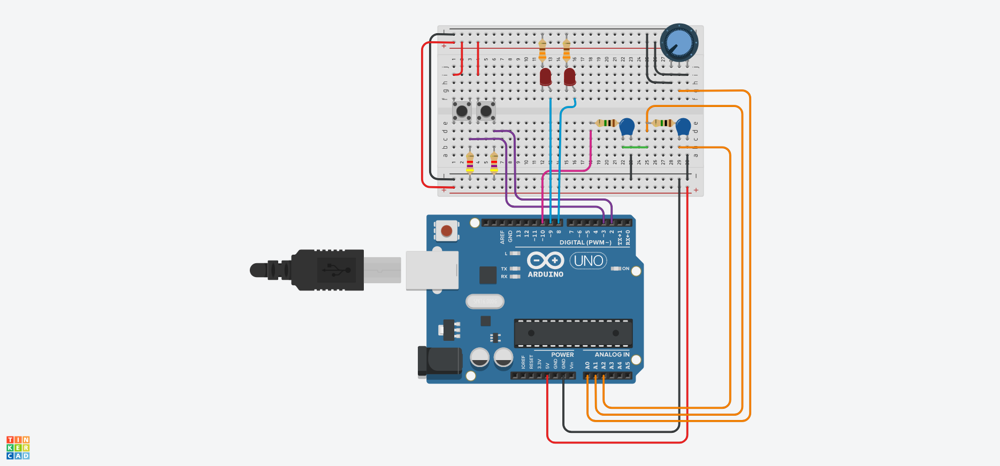

# Laboratorio de control moderno

## Tabla de contenidos
* [Información general](#Información)
* [Descripción del Hardware usado](#Hardware)
* [Descripción de los controladores usados](#Software)

## Información
Este proyecto muestra como implementar controladores y observadores lineales mediante la plataforma Arduino.

## Hardware
El algoritmo de control/observación se realiza en la plataforma Arduino UNO R3 y una planta RC-RC, con R1 = R2 = 1 ohm, y C1 = C2 = 1 uf. Una descripción del hardware usado es mostrada en la Figura. 



### La lista de partes es la siguiente:

* Una placa de desarrollo Arduino UNO R3
* Opcional (Un shield LCFIME-PCB 1.0)
* 2 resistencias de 1 Mohm. 
* 2 capacitores de 1 uf.
* 1 Potenciometro 100 K
* 2 Resistencias 330 ohms
* 2 Resistencias 4.7 kohms
* 2 Leds
* 2 Switches

Todos los componentes pueden ser montados en un breadboard de acuerdo a la figura presnetada, o en el shield.

### Las entradas y salidas del sistema son las siguientes  

* Pin A0 Referencia a seguir
* Pin A1 Voltaje en el capacitor 1
* Pin A2 Voltaje en el capacitor 2
* Pin 10 Señal de control
* Pin 2 Entrada de arranque
* Pin 3 Entrada de paro
* Pin 8 Indicador LED sistema activado
* Pin 9 Indicador LED sistema desactivado
	
## Modelo

El modelo dinámico del circuito RC-RC es un sistema de segundo orden que puede ser representado en espacio de estados de la manera siguiente.

Primeramente, se usa la ley de mallas de Kirchhoff:
```math
\begin{eqnarray*}
  u_i(t) & = & i_1(t)R_1+V_{C1}(t),  \\
  V_{C1}(t) & = & i_2(t)R_2 + V_0(t), 
\end{eqnarray*}
```
junto con las relaciones a ser cumplidas por los capacitores:
```math
\begin{eqnarray*}
  i_1(t)-i_2(t) & = & C_1 \frac{dV_{C1}(t)}{dt}, \\
  i_2(t) & = & C_2\frac{dV_{C2}(t)}{dt},
\end{eqnarray*}
```
por lo tanto $i_1(t)=C_2\frac{dV_0(t)}{dt}+C_1\frac{dV_{C1}(t)}{dt}$

Re escribiendo las ecuaciones de malla en funcion de los voltajes en los capacitores y sus derivadas:
```math
\begin{eqnarray*}
u_i(t) & = & R_1C_2 \frac{dV_0(t)}{dt} +  R_1C_1 \frac{dV_{C1}(t)}{dt} + V_{C1}, \\
V_{C1}(t) & = & R_2C_2 \frac{dV_0(t)}{dt} + V_0(t),
\end{eqnarray*}
```
y acomodando en forma matricial, se tiene
```math
\begin{eqnarray*}
\left[\begin{array}{cc}R_1C_1 & R_1C_2 \\ 0 & R_2C_2\end{array}\right]\left[\begin{array}{l}\dot{V}_{C_1} \\ \dot{V}_o \end{array}\right] & = & \left[\begin{array}{rr}-1 & 0 \\ 1 & -1  \end{array}\right]\left[\begin{array}{l}V_{C_1}\\V_o\end{array}\right]+\left[\begin{array}{c}1 \\ 0 \end{array}\right]V_i.
\end{eqnarray*}
```

Considerando la inversa:
```math
\begin{eqnarray*}
\left[\begin{array}{cc}R_1C_1 & R_1C_2 \\ 0 & R_2C_2\end{array}\right]^{-1} & = & \frac{1}{R_1C_1R_2C_2}\left[\begin{array}{cr}R_2C_2 & -R_1C_2 \\ 0 & R_1C_1\end{array}\right]\\ & = & \left[\begin{array}{cr}\frac{1}{R_1C_1} & \frac{-1}{R_2C_1} \\ 0 & \frac{1}{R_2C_2}\end{array}\right],
\end{eqnarray*}
```
el sistema queda:
```math
\begin{eqnarray*}
  \left[\!\! \begin{array}{l}\dot{V}_{C_1} \\ \dot{V}_o \end{array}\!\! \right]\!\! & \!\! =\!\!  &\!\!  \left[\!\! \begin{array}{cr}\frac{1}{R_1C_1} & \frac{-1}{R_2C_1} \\ 0 & \frac{1}{R_2C_2}\end{array}\right]\!\! \left[\!\! \begin{array}{rr}-1 & 0 \\ 1 & -1  \end{array}\right]\!\! \left[\!\! \begin{array}{l}V_{C_1}\\V_o\end{array}\right]\!\! +\!\! \left[\!\! \begin{array}{cr}\frac{1}{R_1C_1} & \frac{-1}{R_2C_1} \\ 0 & \frac{1}{R_2C_2}\end{array}\right]\!\! \left[\!\! \begin{array}{c}1 \\ 0 \end{array}\!\! \right]u_i(t).
\end{eqnarray*}
```

Definiendo las variables de estado como sigue;
```math
\begin{eqnarray*}
  x_1(t) & \stackrel{\triangle}{=} & V_{C1}(t), \\
  x_2(t) & \stackrel{\triangle}{=} & V_{C2}(t)=V_0(t),
\end{eqnarray*}
```
el modelo en espacio de estados es: 
```math
\begin{eqnarray*}
  \left[\!\!\begin{array}{l}\dot{x}_{1}(t) \\ \dot{x}_2 (t) \end{array}\!\!\right] & = &  \left[\!\!\begin{array}{cr}-\frac{1}{R_1C_1}-\frac{1}{R_2C_1} & \frac{1}{R_2C_1} \\ \frac{1}{R_2C_2} & -\frac{1}{R_2C_2}\end{array}\!\!\right]\!\!\left[\begin{array}{l}x_{1}(t) \\ x_2(t) \end{array}\!\!\right]\!\!+\!\!\left[\!\!\begin{array}{c}\frac{1}{R_1C_1} \\ 0 \end{array}\right]u_i(t) \\ 
  y(t) & = & \left[\begin{array}{cc}0 & 1\end{array}\right]\left[\begin{array}{c}x_{1}(t) \\ x_2(t) \end{array}\right],
\end{eqnarray*}
```
donde $x_{1}(t)$ es el voltaje en el primer capacitor (conectado al pin A1), $x_{2}(t)$ el voltaje en el segundo (conectado al pin A2), $u(t)$ es la entrada a la planta (conectado al pin 10), y $y(t)$ la salida de la planta (conectado al pin A2). 

## Diseño de controladores y observadores

### Controlador
Iniciamos resolviendo el problema de regulación considerando  $K \stackrel{\triangle}{=} [k_1 \quad k_2 ].$ El polinomio característico de lazo cerrado (obtenido de manera simbólica) queda:

```math
\begin{eqnarray*}
|\lambda I-A+BK| & = & \lambda^2+\left(\frac{1}{R_1C_1}+\frac{1}{R_2C_1}+\frac{k_1}{R_1C_1}+\frac{1}{R_2C_2}\right)\lambda \\ & & +\frac{1}{R_1C_1R_2C_2}+\frac{1}{R_2C_1R_2C_1}+\frac{k_1}{R_1C_1R_2C_2} \\ & & -\frac{1}{R_2C_1R_2C_2}+\frac{k_2}{R_2C_2R_1C_2}
\end{eqnarray*}
```

Considerando que los valores propios deseados de lazo cerrado como $\{-a_1,-a_2\}$ y $a_1>0$, $a_2>0$. El polinomio característico deseado queda: $$(\lambda+a1)(\lambda+a2) = \lambda ^2 + (a1+a2)\lambda + a1\cdot a2$$ Los valores de $k_1$ y $k_2$ se obtienen de igualar ambos polinomios: $$a1 + a2 = \frac{1}{R_1C_1}+\frac{1}{R_2C_1}+\frac{k_1}{R_1C_1}+\frac{1}{R_2C_2}$$ por lo tanto:
$$k_1 = R_1C_1 \left( a1 + a2 - \frac{1}{R_1C_1}- \frac{1}{R_2C_1}-\frac{1}{R_2C_2}\right)$$
por otro lado:
```math
\begin{eqnarray*}
a1\cdot a2 & = & \frac{1}{R_1C_1R_2C_2}+\frac{1}{R_2C_1R_2C_1}+\frac{k_1}{R_1C_1R_2C_2}-\frac{1}{R_2C_1R_2C_2}\\ & & + \frac{k_2}{R_2C_2R_1C_2}
\end{eqnarray*}
```
despejando la ganancia $k_2$:
```math
\begin{eqnarray*}
  k_2 & = & R_1C_2R_2C_2 \left( a1 a2\!-\!\frac{1}{R_1C_1R_2C_2}-\frac{1}{R_2C_1R_2C_1} -\frac{k_1}{R_1C_1R_2C_2}\right. \\ & & \left. +\frac{1}{R_2 C_1 R_2 C_2}\right)
\end{eqnarray*}
```


### Observador

Sea $L = \left[\begin{array}{c}L_1 \\ L_2\end{array}\right]$ la ganancia requerida para dise\~nar un observador. Determinando el polinomio caracter\'{\i}stico del observador:
```math
\begin{eqnarray*}
  |\lambda I - A+LC| & = & \lambda ^2+\left(\frac{1}{R_1C_1}+\frac{1}{R_2C_2}+\frac{1}{R_2C_2}+L_2\right)\lambda \\ & & + \left(\frac{1}{R_1C_1}+\frac{1}{R_2C_1}\right) \left(\frac{1}{R_2C_2}+L_2\right)\\ & & +\frac{1}{R_2C_2}\left(L_1-\frac{1}{R_2C_1}\right).
\end{eqnarray*}
```

Considerando los valores propios deseados para el observador: $\{-b_1, -b_2\}$, con $b_1>0$ y $b_2>0$. El polinomio caracter\'{\i}stico del observador es:
$$( \lambda + b_1)(\lambda+b_2)=\lambda^2+(b_1+b_2)\lambda+b_1\cdot b_2.$$ 

Igualando coeficientes de ambos polinomios: 
$$\frac{1}{R_1C_1}+\frac{1}{R_2C_2}+\frac{1}{R_2C_2}+L_2=b_1+b_2$$

$$L_2=b_1+b_2-\frac{1}{R_1C_1}-\frac{1}{R_2C_2}-\frac{1}{R_2C_2}$$

$$b_1\cdot b_2= \left(\frac{1}{R_1C_1}+\frac{1}{R_2C_1}\right) \left(\frac{1}{R_2C_2}+L_2\right)+\frac{1}{R_2C_2}\left(L_1-\frac{1}{R_2C_1}\right)$$

$$L_1 = R_2C_2\left[b_1\cdot b_2 - \left(\frac{1}{R_1C_1}+\frac{1}{R_2C_1}\right) \left(\frac{1}{R_2C_2}+{L_2}\right)\right]+\frac{1}{R_2C_1}$$

### Servosistemas

#### Solución por cambio de coordenadas

Enseguida se resuelve el problema de servomecanismo:
$$u(t) = -Kx(t)+g \cdot y_r$$ 

$$g = \left[\begin{array}{cc}K & 1 \end{array}\right]\left[\begin{array}{cc}A & B \\C & D\end{array}\right]^{-1}\left[\begin{array}{c}0 \\ 0 \\ 1\end{array}\right]$$

$$g = \left[\begin{array}{ccc}k_1 & k_2 & 1\end{array}\right]\left[\begin{array}{ccc} -\frac{1}{R_1C_1}-\frac{1}{R_2C_1} & \frac{1}{R_2C_1} & \frac{1}{R_1C_1} \\ \frac{1}{R_2C_2} & -\frac{1}{R_2C_2}  & 0 \\ 0 & 1 & 0\end{array}\right]^{-1}\left[\begin{array}{c}0 \\ 0 \\ 1\end{array}\right]$$

$$g = \left[\begin{array}{ccc}k_1 & k_2 & 1\end{array}\right]\left[\begin{array}{ccc} 0 & R_2C_2 & 1 \\ 0 & 0  &  1 \\ R_1C_1 & R_2C_2+R_1C_2 & 1\end{array}\!\!\right]\left[\begin{array}{c}0 \\ 0 \\ 1\end{array}\right]$$

$$g = k_1+k_2+1$$

#### Solución mediante control integral para sistemas tipo 0

Claramente el sistema es tipo 0 (sin polos en el origen), y se requiere agregar un integrador en la ganancia de lazo.
```math
\begin{eqnarray*}
u(t) & = & -K x(t) + k_0 x_0(t) \\
\dot{x}_0(t) & = & r - y(t)
\end{eqnarray*}
```

Cerrando el lazo, la matriz del sistema extendido retroalimentado queda:
```math
\begin{eqnarray*}
\bar{A}_{CL} & = & \left[\begin{array}{ccc}0 & 0 & -1 \\ \frac{k_0}{R_1C_1} & -\frac{1}{R_1C_1}-\frac{1}{R_2C_1}-\frac{k_1}{R_1C_1} & \frac{1}{R_2C_1}-\frac{k_2}{R_1C_1} \\ 0 & \frac{1}{R_2C_2} & -\frac{1}{R_2C_2}\end{array}\right]
\end{eqnarray*}
```

El polinomio caracter\'{\i}stico deseado resulta:
```math
\begin{eqnarray*}
\lambda^3\!\!+(a1\!+\!a2\!+\!a3)\lambda^2 + (a1a3\!+\!a2a3\!+\!a1a2)\lambda\!+\!a1a2a3 = 0
\end{eqnarray*}
```
Igualando coeficientes se obtiene:
```math
\begin{eqnarray*}
k_0 & = & R_1R_2C_1C_2a1a2a3\\
k_1 & = & R_1C_1\left(a1+a2+a3-\frac{1}{R_1C_1}-\frac{1}{R_2C_1}-\frac{1}{R_2C_2}\right) \\
k_2 & = & R_1C_1\left[R_2C_2\left(a1a3+a2a3+a1a2\right)+\frac{1}{R_2C_1}\right]
\end{eqnarray*}
```

### Seguimiento de trayectorias (Tracking)

La soluci\'on al problema de seguimiento se plantea con la siguiente ley de control
```math
\begin{eqnarray}
  u(t) & = & -Kx(t) + g y_d + G z(t) \nonumber\\ 
  \mbox{donde:} & & \nonumber \\
  \dot z (t) & = & Wz(t),\ \ z(0) \nonumber \\
  G & = & \Gamma + K \cdot \Pi \nonumber\\
  \Pi\cdot W & = & A\cdot\Pi+B\cdot \Gamma \label{eq:reg1}\\
  0 & = & C\cdot\Pi+D\cdot \Gamma - C_r\label{eq:reg2} 
\end{eqnarray}
```

$K$ es seleccionada tal que $A-BK$ tenga valores propios con parte real negativa y $g$ es la misma que se utiliz\'o en la soluci\'on al problema de servomecanismo.

La se\~nal de referencia se genera mediante un exo-sistema sin entradas, es decir, un oscilador arm\'onico. Para obtener la referencia se considera el sistema 
```math
\begin{eqnarray*}
 \dot{z}(t) & = & Wz(t) \ \ \ z(0)\in\Re^r \\ 
       r(t) & = & C_r z(t) 
\end{eqnarray*}
```

Se consideran dos señales de referencia:
\begin{enumerate}
  \item[a)] Referencia $r(t)=sen(\omega t)$. Se hace la siguiente selecci\'on:
  $$W=\left[\begin{array}{rc} 0 & \omega \\ -\omega & 0 \end{array} \right];\ \ z(0)=\left[\begin{array}{c} 0 \\ 1 \end{array} \right];\ \ C_r=\left[\begin{array}{cc}1 & 0 \end{array}\right]$$
  lo cual produce una senoidal:
  
  \centerline{\includegraphics[scale=0.5]{seno.eps}}
  \item[b)] Referencia $r(t)=sen(\omega_1 t)+\frac{1}{3} sen(\omega_2 t)$, con $\omega_2 = 3 \omega_1$

$$  W=\left[\begin{array}{ccll}0 & 0 & 0 & \omega_1\\ 0 & 0 & \omega_2 & 0\\ 0 & -\omega_2 & 0 & 0\\-\omega_1 & 0 & 0 & 0\end{array}\right];\ \ \ z(0)=\left[\begin{array}{r}1 \\ \displaystyle\frac{1}{3} \\ 0 \\ -1\end{array}\right];\ \ C_r=\left[\begin{array}{cccc}1 & 0 & 1 & 0\end{array}\right]
$$

#### Seguimiento de cosenoidal

Se utiliza la misma $K$ obtenida previamente para los otros controladores as\'{\i} como la $g$ obtenida previamente para el problema de servomecanismo. 
 
Particularizando para el caso de la referencia senoidal se tiene que las ecuaciones del regulador, primero la ecuaci\'on (\ref{eq:reg1}):
\begin{eqnarray*}
\left[\!\!\begin{array}{cc}\Pi_{11} & \Pi_{12}\\ \Pi_{21} & \Pi_{22}\end{array}\!\!\right]\!\!\left[\!\!\begin{array}{cc} 0 & \omega\\ -\omega & 0\end{array}\!\!\right]\!\! & = & \!\!\left[\!\!\!\begin{array}{cr}  -\frac{1}{R_1C_1}-\frac{1}{R_2C_1} & \frac{1}{R_2C_1} \\ \frac{1}{R_2C_2} & -\frac{1}{R_2C_2}\end{array}\!\!\right]\!\!\left[\!\!\begin{array}{cc}\Pi_{11} & \Pi_{12}\\ \Pi_{21} & \Pi_{22}\end{array}\!\!\right]\!\!+\!\!\left[\!\!\begin{array}{c}\frac{1}{R_1C_1} \\  0\end{array}\!\!\!\right]\!\!\left[\Gamma_1\ \ \Gamma_2\right]
\end{eqnarray*}
realizando operaciones:
\begin{eqnarray*}
\left[\!\!\begin{array}{cc}-\omega\Pi_{12} & \omega\Pi_{11}\\ -\omega\Pi_{22} & \omega\Pi_{21}\end{array}\!\!\right]\!\! & = & \!\!\left[\!\!\!\begin{array}{cc}  -\frac{\Pi_{11}}{R_1C_1}-\frac{\Pi_{11}-\Pi_{21}}{R_2C_1} & -\frac{\Pi_{12}}{R_1C_1}-\frac{\Pi_{12}-\Pi_{22}}{R_2C_1} \\ \frac{\Pi_{11}}{R_2C_2}-\frac{\Pi_{21}}{R_2C_2} & \frac{\Pi_{12}}{R_2C_2}-\frac{\Pi_{22}}{R_2C_2}\end{array}\!\!\right]\!+\!\left[\!\!\begin{array}{cc}\frac{\Gamma_1}{R_1C_1} & \frac{\Gamma_2}{R_1C_1} \\  0 & 0 \end{array}\!\!\!\right]
\end{eqnarray*}
de donde resulta el siguiente sistema de ecuaciones:
\begin{eqnarray*}
-\omega\Pi_{12} & = & -\left(\frac{\Pi_{11}}{R_1C_1}+\frac{\Pi_{11}}{R_2C_1}\right)+\frac{\Pi_{21}}{R_2C_1}+\frac{\Gamma_1}{R_1C_1} \\ 
\omega\Pi_{11}  &= &-\left(\frac{\Pi_{12}}{R_1C_1}+\frac{\Pi_{12}}{R_2C_1}\right)+\frac{\Pi_{22}}{R_2C_1}+\frac{\Gamma_2}{R_1C_1} \\
 -\omega\Pi_{22} & = & \frac{\Pi_{11}}{R_2C_2}-\frac{\Pi_{21}}{R_2C_2} \\ 
 \omega\Pi_{21} & = & \frac{\Pi_{12}}{R_2C_2}-\frac{\Pi_{22}}{R_2C_2} 
\end{eqnarray*}
Ahora para la ecuaci\'on (\ref{eq:reg2}), se tiene:
\begin{eqnarray*}
\left[\begin{array}{cc}0 & 0 \end{array}\right] & = & \left[\begin{array}{cc}0 & 1 \end{array}\right]\left[\begin{array}{cc}\Pi_{11} & \Pi_{12} \\ \Pi_{21} & \Pi_{22}\end{array}\right]-\left[\begin{array}{cc}1 & 0 \end{array}\right]
\end{eqnarray*}
simplificando queda:
\begin{eqnarray*}
\left[\begin{array}{cc}0 & 0 \end{array}\right] & = &  \left[\begin{array}{cc}\Pi_{21} & \Pi_{22} \end{array}\right]-\left[\begin{array}{cc}1 & 0 \end{array}\right]
\end{eqnarray*}
y quedan las dos ecuaciones:
\begin{eqnarray*}
0 & = & \Pi_{21}-1 \\
0 & = & \Pi_{22}
\end{eqnarray*}
Por lo tanto los primeros dos valores para los elementos de $\Pi$ son: $\boxed{\Pi_{21}=1}$ y $\boxed{\Pi_{22}=0}$
y para los otros valores:
\begin{eqnarray*}
 -\omega (0) & = &  \frac{\Pi_{11}}{R_2C_2}-\frac{(1)}{R_2C_2} \ \Rightarrow\ \boxed{\Pi_{11}=1}\\ 
 \omega (1) & = & \omega\frac{\Pi_{12}}{R_2C_2}-\frac{0}{R_2C_2}\ \Rightarrow \boxed{\Pi_{12}=\omega R_2C_2}   \\ \omega (1) & = & -\left(\frac{\omega R_2C_2}{R_1C_1}+\frac{\omega R_2C_2}{R_2C_1}\right)+\frac{(0)}{R_2C_1}+\frac{\Gamma_1}{R_1C_1}\\[2mm] \Gamma_1 & = & \left[\omega + \left(\frac{\omega R_2C_2}{R_1C_1}+\frac{\omega R_2C_2}{R_2C_1}\right)\right] R_1C_1\\[2mm] -\omega (1) & = & -\left(\frac{(1)}{R_1C_1}+\frac{(1)}{R_2C_1}\right)(1)+\frac{(0)}{R_2C_1}+\frac{\Gamma_2}{R_1C_1}\\[2mm] \Gamma_2 & = & \left[\frac{1}{R_1C_1}+\frac{1}{R_2C_1}-\omega\right]R_1C_1
\end{eqnarray*}
y entonces calculando el valor de la ganancia $G$
\begin{eqnarray*}
G & = & \Gamma + K\Pi \\[2mm] 
G & = & \left[\begin{array}{cc}k_1+k_2+1-\omega^2R_2C_2R_1C_1 & \omega\left(R_1C_1+R_2C_2+R_1C_2+k_1R_2C_2\right) \end{array}\right]
\end{eqnarray*}

#### Seguimiento de referencia sumatoria de cosenoidales

Particularizando para el caso de la referencia correspondiente se tiene que las ecuaciones del regulador, primero la ecuaci\'on (\ref{eq:reg2}):
\begin{eqnarray*}
\left[\begin{array}{cccc} 0 & 0 & 0 & 0\end{array}\right] & = & \left[\begin{array}{cc}0 & 1\end{array}\right]\left[\begin{array}{cccc}\Pi_{11} & \Pi_{21} & \Pi_{31} & \Pi_{41} \\ \Pi_{21} & \Pi_{22} & \Pi_{23} & \Pi_{24}\end{array}\right]-\left[\begin{array}{cccc} 1 & 0 & 1 &  0\end{array}\right] \\[3mm] 
\left[\begin{array}{cccc} 0 & 0 & 0 & 0\end{array}\right] & = & \left[\begin{array}{cccc}\Pi_{21} & \Pi_{22} & \Pi_{23} & \Pi_{24}\end{array}\right]-\left[\begin{array}{cccc} 1 & 0 & 1 &  0\end{array}\right]
\end{eqnarray*}
de donde se obtienen los valores de cuatro elementos de la matriz $\Pi$:
\begin{eqnarray*}
0 & = & \Pi_{21} - 1;\ \ \ \ \Rightarrow\ \ \Pi_{21}=1 \\ 
0 & = & \Pi_{22};\ \ \ \ \Rightarrow\ \ \Pi_{22}=0 \\
0 & = & \Pi_{23} - 1;\ \ \ \ \Rightarrow\ \ \Pi_{23}=1 \\ 
0 & = & \Pi_{24};\ \ \ \ \Rightarrow\ \ \Pi_{24}=0 
\end{eqnarray*}


\begin{eqnarray*}
\left[\begin{array}{cccc}\Pi_{11} & \Pi_{21} & \Pi_{31} & \Pi_{41} \\ \Pi_{21} & \Pi_{22} & \Pi_{23} & \Pi_{24}\end{array}\right] \left[\begin{array}{ccll}0 & 0 & 0 & \omega_1\\ 0 & 0 & \omega_2 & 0\\ 0 & -\omega_2 & 0 & 0\\-\omega_1 & 0 & 0 & 0\end{array}\right] & = & A \left[\begin{array}{cccc}\Pi_{11} & \Pi_{21} & \Pi_{31} & \Pi_{41} \\ \Pi_{21} & \Pi_{22} & \Pi_{23} & \Pi_{24}\end{array}\right] + \left[\begin{array}{c}\frac{1}{R_1C_1} \\ 0\end{array}\right]
\end{eqnarray*}

\begin{eqnarray*}
\left[\begin{array}{cccc}-\omega_1 \Pi_{14} & -\omega_2\Pi_{13} & \omega_2\Pi_{12} & \omega_1\Pi_{11} \\ -\omega_1\Pi_{24} & -\omega_2\Pi_{23} & \omega_2\Pi_{22} & \omega_1\Pi_{21}\end{array}\right] & = & \left[\begin{array}{cc}-\frac{\Pi_{11}}{R_1C_1}-\frac{\Pi_{11}}{R_2C_1}+\frac{\Pi_{21}}{R_2C_1} & -\frac{\Pi_{12}}{R_1C_1}-\frac{\Pi_{12}}{R_2C_1}+\frac{\Pi_{22}}{R_2C_1} \\ \frac{\Pi_{11}}{R_2C_2}-\frac{\Pi_{21}}{R_2C_2} &  \frac{\Pi_{12}}{R_2C_2}-\frac{\Pi_{22}}{R_2C_2} \end{array}\right. \\ & & \left.\begin{array}{cc}-\frac{\Pi_{13}}{R_1C_1}-\frac{\Pi_{13}}{R_2C_1}+\frac{\Pi_{23}}{R_2C_1} & -\frac{\Pi_{14}}{R_1C_1}-\frac{\Pi_{14}}{R_2C_1}+\frac{\Pi_{24}}{R_2C_1} \\ \frac{\Pi_{13}}{R_2C_2}-\frac{\Pi_{23}}{R_2C_2} &  \frac{\Pi_{14}}{R_2C_2}-\frac{\Pi_{24}}{R_2C_2}\end{array}\right] \\ 
& & +\left[\begin{array}{cccc}
\frac{\Gamma_1}{R_1C_1} & \frac{\Gamma_2}{R_1C_1} & \frac{\Gamma_3}{R_1C_1} & \frac{\Gamma_4}{R_1C_1} \\ 
0 & 0  & 0 & 0 \end{array}\right]
\end{eqnarray*}
de donde resulta el siguiente sistema de ecuaciones
\begin{eqnarray*}
-\omega_1\Pi_{14} & = & -\frac{\Pi_{11}}{R_1C_1}-\frac{\Pi_{11}}{R_2C_1}+\frac{\Pi_{21}}{R_2C_1}+\frac{\Gamma_1}{R_1C_1} \\ 
-\omega_2\Pi_{13} & = & -\frac{\Pi_{12}}{R_1C_1}-\frac{\Pi_{12}}{R_2C_1}+\frac{\Pi_{22}}{R_2C_1}+\frac{\Gamma_2}{R_1C_1} \\ 
-\omega_2\Pi_{12} & = & -\frac{\Pi_{13}}{R_1C_1}-\frac{\Pi_{13}}{R_2C_1}+\frac{\Pi_{23}}{R_2C_1}+\frac{\Gamma_3}{R_1C_1} \\
-\omega_1\Pi_{11} & = & -\frac{\Pi_{14}}{R_1C_1}-\frac{\Pi_{14}}{R_2C_1}+\frac{\Pi_{24}}{R_2C_1}+\frac{\Gamma_4}{R_1C_1} \\ 
-\omega_1\Pi_{24} & = & \frac{\Pi_{11}}{R_2C_2}-\frac{\Pi_{21}}{R_2C_2}  \\ 
-\omega_2\Pi_{23} & = & \frac{\Pi_{12}}{R_2C_2}-\frac{\Pi_{22}}{R_2C_2}  \\ 
-\omega_2\Pi_{22} & = & \frac{\Pi_{13}}{R_2C_2}-\frac{\Pi_{23}}{R_2C_2}  \\ 
-\omega_1\Pi_{21} & = & \frac{\Pi_{14}}{R_2C_2}-\frac{\Pi_{24}}{R_2C_2} 
\end{eqnarray*}
de donde se obtiene:
\begin{eqnarray*}
 \Pi_{11} & = & 1 \\
 \Pi_{12} & = & -\omega_2R_2C_2 \\
 \Pi_{13} & = & 1\\
 \Pi_{14} & = & \omega_1R_2C_2
\end{eqnarray*}

\begin{eqnarray*}
 \Gamma_{1} & = & 1 -\omega_1^2R_1C_1R_2C_2 \\
 \Gamma_{2} & = & \omega_2 C_2\left(R_2 + R_1\right) \\
 \Gamma_{3} & = & R_1C_1\left(-\omega_2^2R_2C_2+\frac{1}{R_1C_1}+\frac{1}{R_2C_1}\right) \\
 \Gamma_{4} & = & \omega_1\left(1 + \frac{R_2C_2}{R_1C_1}+ \frac{R_2C_2}{R_2C_1}\right)
\end{eqnarray*}
Por lo tanto:
$$G=\left[\begin{array}{cccc}\Gamma_1+k_1 + k_2 & \Gamma_2-k_1\omega_2R_2C_2 & \Gamma_3+k_1+k_2 & \Gamma_4+\omega_1k_1R_2C_1\end{array}\right]$$

## Software

### Software Arduino

Todos los algoritmos se implementan en el microcontrolador ATMEL de la plataforma arduino. Los códigos están realizados en el lenguaje Arduino.
La carpeta Arduino contiene varios ejemplos que se detallas a continuación.


### Software PC
